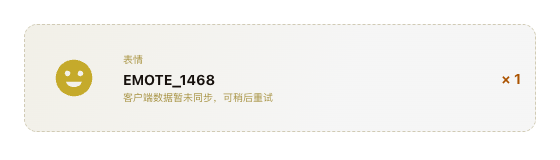
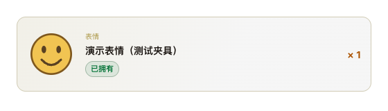

# R189 执行账本

日期：2026-10-02。基线：R188 工作区 0.12.53；本轮版本 **0.12.54**。范围按 R189 P1–P4 执行；R188 已有改动保留，未发布 GitHub Release。

## 实现逐项核对

| 工单项 | 实现 |
|---|---|
| P1-1 | 注册 emotes，固定 LCU `/lol-game-data/assets/v1/summoner-emotes.json` 与 CommunityDragon `/latest/plugins/rcp-be-lol-game-data/global/zh_cn/v1/summoner-emotes.json`；复用现有并行读取、客户端优先和公共磁盘缓存逻辑。 |
| P1-2 | 数组解析 id / name / description / inventoryIcon；缺少或负 id、空名字跳过，字段去空白，图片 sanitize，空结果返回既有目录不可用错误。键为 EMOTE_<id>。 |
| P1-3 | 表情目录名字、描述、图片优先；目录图存在时清空客户端 tile / splash，通用静态图不能覆盖目录图。 |
| P1-4 / P2-3 | 未命名的非空记录按类别与数字编号回退；无数字只显示类别。未知表情清空图片路径，使用分类占位图，不显示原始 EMOTE_1468。 |
| P2-1 | lootNamePending 只读取 dataPending，不再比较名字与 lootId。 |
| P2-2 | R144 空白分支及 collection_reads 的有限重试与耗尽结算保持原实现，仍保留数量、清空无效图，耗尽清除 dataPending。 |
| P3-1 | 表情 / 守卫 / 图标按 itemStatus 输出 ownedKnown / owned：OWNED=true/true，NONE=true/false，其余=false/false；皮肤保持独立原字段。 |
| P3-2 / P3-3 | 三类已拥有沿用 is-owned；未拥有使用 is-missing 与 --muted；未知状态不显示。皮肤“已拥有 / 可升级”及判断保持原样。未添加额外界面说明。 |
| P4-1 | 既有 loot_metadata_source 循环自动记录 emotes、来源和目录条目数。 |
| P4-2 | 所有 loot_name_fallback 加 item_status / catalog_hit，不增加物品数量、完整 lootId 或账号信息。 |

## 专项及变异验证

- Go 专项：`TestR189|TestLootNaming|Test.*Blank|TestRetryExhaustion|TestRetryBudget|TestGetLootPreserves` 通过（1.395 秒）。覆盖 Go 1–6：解析、安全图片路径、实际注册目录读取、目录优先、未知名回退及诊断、三类状态、皮肤原状态、R144 重试、客户端失败后公共回退与双失败。日志 `/private/tmp/r189-focused-go.log`。
- 初次专项失败由测试客户端遗漏凭证导致本地目录未被读取；补齐测试 token 后通过，生产读取逻辑未修改。
- Node 专项：`backend/web/r189.test.cjs` 与 `champions.test.cjs` 共 250 项通过（2.110 秒）。覆盖 Node 7–10：目录名与图标、类别编号无提示、空白 pending / 已结算行为、三类拥有 / 未拥有 / 未知，以及皮肤原文案。
- 既有 R61 非空名称断言同步 R189 语义，R144 测试保留；目录测试数量由固定 4 改为实际注册目录数，新增明确标记的表情夹具。

| 必须执行的变异 | 实际断言 FAIL |
|---|---|
| 不注册表情目录 | Go TestR189RegisteredEmoteCatalogEnrichment 无法获取目录名 / 图片，失败。 |
| 恢复名字等于 ID 就是未同步 | Node 测试 8 的原始名称响应断言失败。新后端类别名“表情 1468”本身不会满足旧相等条件，因此该测试同时保留 dataPending=false 的原始名称用例，检出旧判断。 |
| 前端只对皮肤显示拥有状态 | Node 测试 10 的表情状态断言失败。 |
| 后端未知名仍退回原始 lootId | Go TestR189UnknownLootFallbackAndDiagnostic 六个类别用例失败。 |

脚本 `/private/tmp/r189-mutants.py`，overlay 源码与日志 `/private/tmp/r189-mutants/`。四项均实际运行，因对应断言失败；没有把编译 / 导入失败当作变异检出。

## 独立复核

两个默认只读探子分别核对后端目录 / 诊断 / 状态与前端 / 变异 / 截图。主线程亲自核对两项反馈：

- “仅有 Type、无 ID / 名字的记录”仍被旧 enrich 分支视为 identity-less blank。这是既有 R144 实现，R189 P2-2 明确要求该部分不改，本轮保留；探子提到的 lootIdentityEmpty 同样没有 Type 条件，不能直接替换解决。真实三者全空的重试与结算已有回归覆盖。
- 演示服务最初对所有图片请求返回同一个 SVG；已收紧为仅对目录 fixture 路径返回图片，并断言改后实际请求该路径。拥有 / 未拥有 / 未知三种状态由 Node DOM 测试覆盖，截图展示已拥有。

## 改前 / 改后截图

使用 `desktop/r189-layout.cjs`、实际 lootCard / 图片加载代码 / CSS 与真实 Chromium。改前源码保存在 `/private/tmp/r189-before`；560px 宽、100% 缩放。名字“演示表情（测试夹具）”和笑脸 SVG 均为人工夹具，**不是表情 1468 的真实中文名与图片**。

| 改前 | 改后 |
|---|---|
|  |  |

JSON 证据：`docs/history/reports/r189/before-emote.json`、`after-emote.json`。改前原始 ID、同步提示、分类占位、无拥有状态；改后目录名、目录图片请求、已拥有、无同步提示、无溢出。浏览器日志 `/private/tmp/r189-layout-before.log`、`r189-layout-after.log`。

## 全量验证与构建

- 前端全量 `node --test backend/web/*.test.cjs desktop/*.test.cjs`：1076 项，1075 通过、1 项平台条件跳过、0 失败（296.036 秒）。日志 `/private/tmp/r189-full-node.log`。
- 首次 Go 全量和构建发现 lcu_api_test.go 两条既有测试仍期望原始名称 loot-box / CHEST_224 / MATERIAL_REAL。按 P2-3 更新为材料 / 宝箱 224 / 材料，同时保留原标识、空白状态及非空不 pending 断言；相关专项重跑通过。原失败日志 `/private/tmp/r189-full-go.log`、`r189-public-build.log`、`r189-public-build-retry.log`。
- 最终 `go test ./backend -count=1` 全量通过（236.672 秒），随后 `go vet ./backend` 通过；`git diff --check` 通过。日志 `/private/tmp/r189-full-go-retry.log`、`r189-vet.log`。
- 最终 `DEEP_LEGENDS_KEY_MODE=public ./build-desktop.sh` 完整构建成功：1669 项 Go 测试五分片、Go / installer vet 和测试、Windows 后端构建、NSIS 与外层安装器、包内 runtime / 指纹 / public 收据检查通过。日志 `/private/tmp/r189-public-build-final.log`。
- key mode：**public**，未嵌入 Riot Key；版本 **0.12.54**，源码 / 后端 / 包内指纹均 **9252906c3c40**。
- 安装包：`dist/desktop/Deep Legends Setup 0.12.54-public.exe`；只保留带 public 后缀的安装包。
- SHA-256：`263b318e2c030035e7cbff12282f6cdef02fa87aded1b183397234848a1d21ed`，与 release-build.json / SHA256SUMS-public.txt 及实际文件一致。
- package / lock、AGENTS / CLAUDE、CHANGELOG 与索引已同步；R144 索引备注“非空白记录不再显示未同步由 R189 调整”。
- R188 / R189 工作区修改保留，用户原始验证目录未改动；没有推送或发布。

## 真机边界

工单指定 `lol-loot-diagnostics-1002-2016.jsonl` 原始日志未在工作区提供；本轮依据工单摘要定位，没有声称独立重读该日志。

**表情 1468 的中文名没有在 Windows 真机上核对，需要用户验收。** 本机未连接真实游戏客户端。待安装新版后确认收藏表情目录名 / 图片、拥有状态与客户端一致；导出诊断应有 catalog=emotes，目录命中表情不应再有 loot_name_fallback。若客户端与公共目录均无该 ID，预期降级为“表情 1468”和分类占位图。
