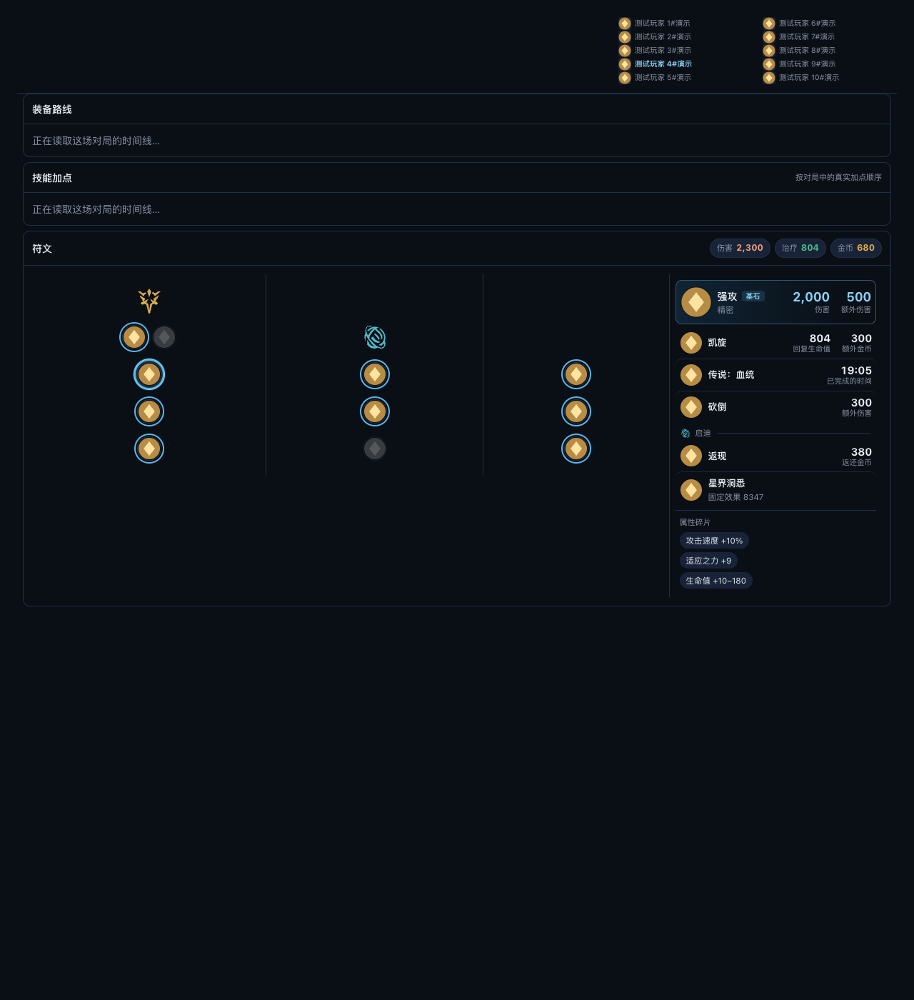
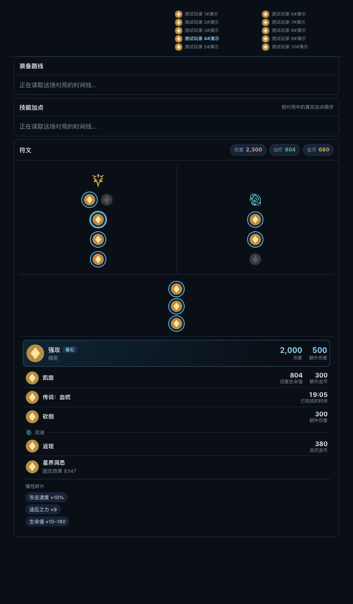
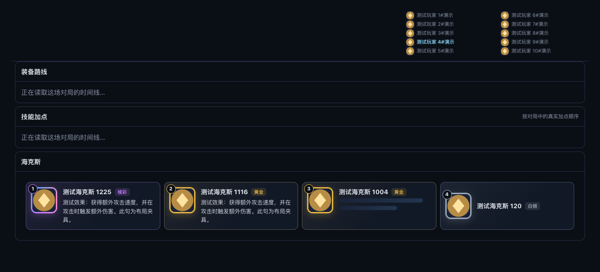
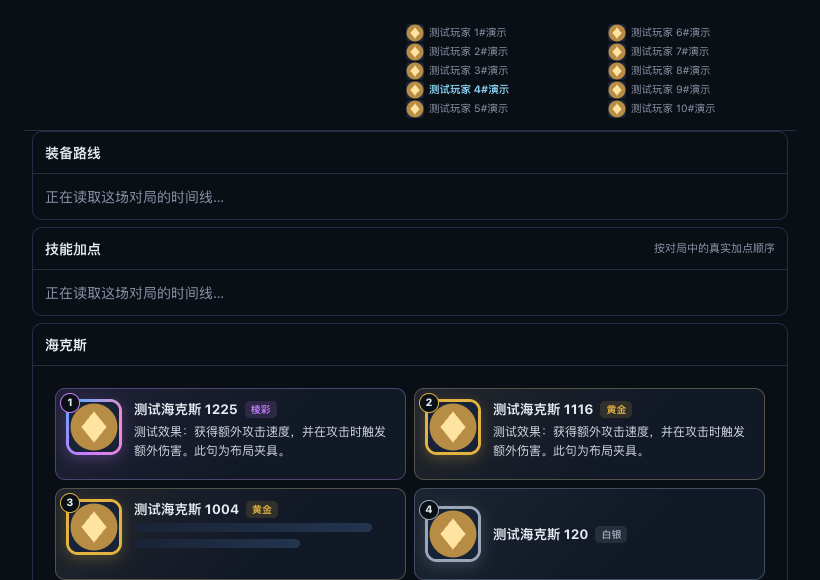
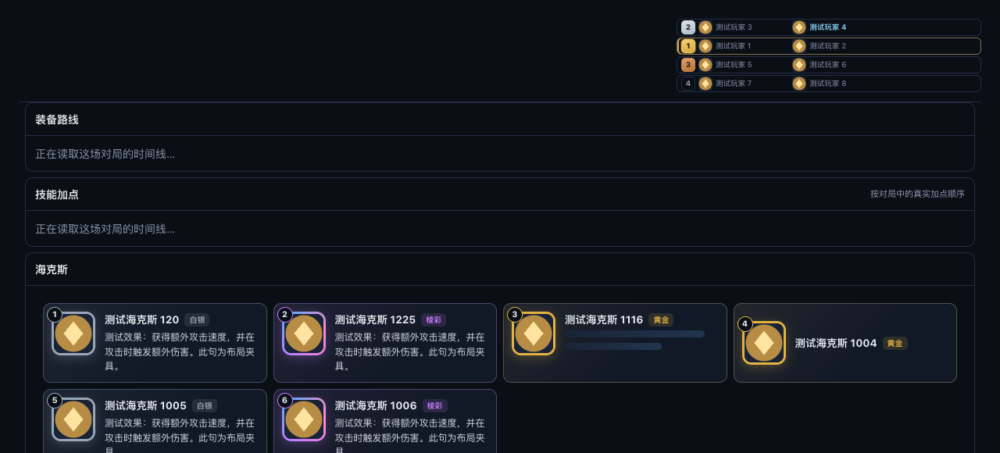
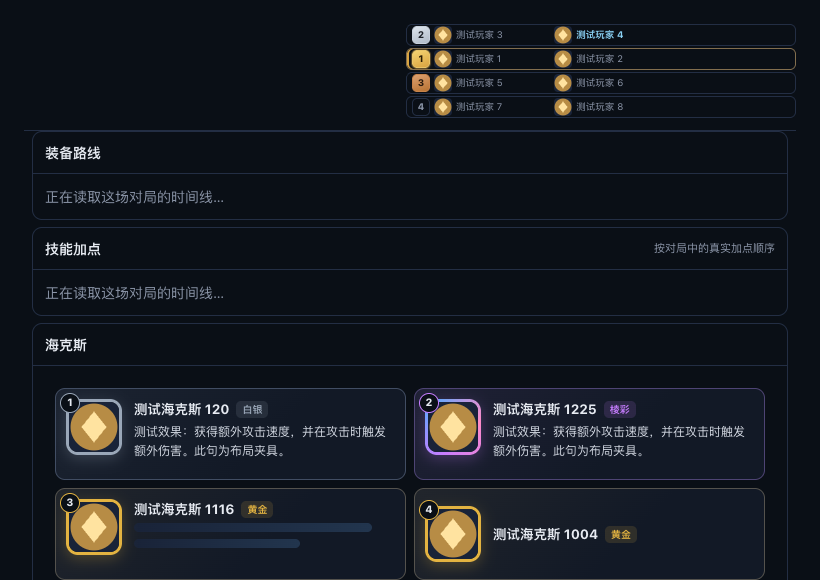

# R190 执行账本

日期：2026-10-02。前置 R188/R189 提交：`10bc2994`。版本 **0.12.54**（R189 已升到该版本，本轮保持工单指定版本）；未推送、未发布 Release。key mode：本轮最终构建使用 **public**。

## 设计冲突与真实数据边界

- 工单 P2-9 写 900px / 左栏 330–420px，设计 PNG / HTML 写 1100px / 左右 3:1。本轮按用户“工单和对应设计图”请求，采用设计图 1100px、`minmax(0,3fr) minmax(280px,1fr)`、宽屏树 34px 图标 / 52px 行高、碎片竖排。共享符文板结构和原有视口断点保留，调整只限构建 split 外壳内。
- 本机为 macOS；仓库仅有本机 LCU 接入，未提供 Windows 远程连接、截图那场 gameId 或真实变量 JSON。因此**未执行工单步骤 2 的 Windows 真实对局读取**，没有编造原始变量或含义。`PERK_EFFECT_OVERRIDES` 的 8008 / 8304 均为空数组，所有未核实的错误模板行隐藏，显示原符文固定效果；待真实样本核实后才能启用修正行。
- Chromium 三种场景均为明确的人工夹具；名字、对局变量、海克斯说明和金色菱形图标不是实战数据。符文系 SVG 使用生产资源；其他布局、事件与样式使用生产代码。不存在真实对局截图验收或 LeagueAkari 数值对照的声明。
- 已读取项目 digest、职业账号归属清单、工单全文、设计 HTML 和 PNG。未改动职业归属和用户原始验证目录。

## 实现逐项核对

| 工单项 | 实现 |
|---|---|
| P1-1–5 | 普通 / 竞技场预览名单共用 playerButton，按 subjectParticipantId 只给名字添加 class；颜色 --primary-strong、700，原 tooltip、打码、省略与 hover 保留。 |
| P2 后端 1 | LCU 18 个变量、Riot / SGP selections 三变量解析，输出最多六个主副系 perkStats，保留有效零；碎片仅保留在原 perkIds。 |
| P2 后端 2 | 新写 riot-match-v2，优先 v2、兼容 v1并标 stale且省略perkStats；POST 单场 match 刷新仅按需重新读一场。前端 Map 保存每场一次会话的 Promise / 失败结果，多视图复用并只回填变量，不覆盖原名称或主体身份。 |
| P2 缓存审计 | Riot 持久化确实 json.Marshal(riotMatch)，365天；SGP riotMatchInfo只存进程内分页缓存，未发现结构体磁盘缓存；LCU 每次详情实时读取，未发现同类对局磁盘缓存。目录 normalized-perks-v2，磁盘白名单同步。 |
| P2 后端 3 | LCU endOfGameStatDescs 转为 eogDescs，归一化缓存可往返；仅 Data Dragon 回退路径缺模板时 CommunityDragon zh_cn 按 ID 只补模板，沿用 fetchCommunityDragonAugmentPart 的缓存、4秒预算、45秒退避。失败不阻断符文树。 |
| P2 前端 4–5 | 纯函数严格拆数组 / br / 首个冒号、两条标签简化、整数和 m:ss；未知模板丢弃；8008 / 8304独立降级表；汇总逐符文逐类别取最大值后相加，零 chip 不显示。 |
| P2 前端 6–10 | 槽位排序、基石44px / 18px主题色、普通32px / 15px、16px数值间距、副系分隔、碎片、无变量灰字 shortDesc、目录未加载不渲染列表。委托 pointer / focus 只切 class，未选图标不联动。共享 board 仅新增 data-perk-id；只在构建内挂载时允许选中图标键盘聚焦。 |
| P3 后端 1 | GET augment-descriptions 验证最多6 ID；arena走目录，海斗走详情正文，单ID8秒、并发最多2；严格取校验后的原始详情正文（独立字段保留，不使用旧loader的目录说明回退），空说明和占位句 unavailable；诊断记录数量和耗时、不记正文。空slug原loader不会读取海斗详情，补上既有/augments目录解析ID→slug，再复用原详情缓存、形状校验与正文解析。 |
| P3 前端 2–7 | 仅打开构建请求；Map按ID复用与结算失败；品质卡片56px图标、20px顺序、3行纯文本和全量tooltip；两条骨架或紧凑无说明状态；海斗/斗魂复用，已读说明补进图标tooltip，没有额外tooltip请求。 |

## 验证记录

- R188/R189 前置 Go 专项通过：`/private/tmp/r190-preflight-go.log`。最初沙箱运行因 httptest 禁止绑定端口而失败，授权环境重跑通过，不是代码断言失败。
- R190 Node 专项 9 组覆盖工单 1–13、20–22、单场刷新成功 / 失败 / 跨视图复用和真实 build 点击触发条件，通过。`/private/tmp/r190-node-focused.log`。
- 相关前端回归 322 项通过：`/private/tmp/r190-node-regression.log`（后续新增 build 点击一组在最终全量中验证）。
- R190 Go 专项初次五组通过：解析 / 缓存刷新HTTP / 目录 / 真说明来源 / 参数与并发；增加 CommunityDragon 实际补充读取与失败降级用例后最终六组通过（1.810秒），日志 `/private/tmp/r190-go-focused-final.log`。
- 七个要求的变异全部实际行为断言 FAIL，无编译、导入或语法失败充当检出。脚本 `desktop/r190-mutants.py`；结果 `docs/history/reports/r190/mutations.json` 与七份日志。对应：全部名单高亮→1；收益相加→10；删覆盖表→9；共享board改结构→12；删除ID缓存→22；Riot漏变量→15；改用meta胜率摘要→18。
- 最终 Node 全量1085项：1084通过、1项平台条件跳过、0失败（见 `/private/tmp/r190-full-node-final.log`）；1675项Go测试五分片全部通过，Go/installer vet与installer测试通过。完整public构建的最终收据在下方记录。

## Chromium 对照

`node desktop/r190-layout.cjs`，azure、100%缩放，三场景各1280 / 820px。六张截图与 `layout.json` 位于 `docs/history/reports/r190/`，布局断言通过：无页面水平溢出、唯一主体名字高亮且700、宽屏树/效果左右、窄屏上下、海斗4卡 / 斗魂6卡、骨架2条 / 紧凑卡1张。截图发现全局.stat样式污染数值内边距，已限定本地数值块背景/内边距并重新截图。

| 场景 | 宽 | 窄 |
|---|---|---|
| 普通排位 |  |  |
| 海克斯大乱斗 |  |  |
| 斗魂竞技场 |  |  |

设计差异：数字和标签来自夹具模板的实际简化规则，不照抄设计示例短标签；未核实的8008 / 8304收益隐藏；树结构和未选项随目录实际槽位，未重写共享board来伪造设计的完整符文目录。测试图标明确为夹具。构建设备路线/技能区保持原有实现。

## Windows 待验

1. 导出指定灵活排位本人的 perk0..5 和18个变量原始JSON，再找带神奇之鞋对局；结合客户端结算页/英文本核实覆盖表，再启用核实后的行。
2. 安装本轮产物，各主题核对普通 / 竞技场名单高亮可读；看他人页签时高亮该页签主体。
3. 符文数字与真实客户端 / LeagueAkari逐项对照；8008 / 8304当前降级不显示错误行。
4. 海斗、斗魂真实说明加载、失败紧凑态、tooltip与窄屏卡片。未声称已完成这些真机项。

## 独立复核

两个默认只读探子检查后端与前端。后端发现旧详情loader在正文为空时会补目录description，新接口已改为只取校验后的原始正文；回归明确设置1225目录存在非空说明，而正文为空仍unavailable。前端未发现确定遗漏。最终七项变异重跑通过；沙箱独立截图复跑受端口权限限制，主线程授权环境截图已通过。

### 全量首轮发现与修复

- 首次 public 构建被既有 `TestR100PerksNeverWaitForOptionalAugmentsAndPersist` 检出：LCU完整目录不应等待4秒可选模板。按工单“客户端未连接回退”要求收窄补充读取到Data Dragon路径，LCU直接使用自身模板；该性能护栏和R190专项重跑通过（1.842秒）。首轮日志 `/private/tmp/r190-public-build.log`，修复验证 `/private/tmp/r190-go-repair.log`。
- 首轮Node全量1085项，1080通过、4失败、1平台跳过（244.011秒）。R88隔离函数编译器补齐新增的主体判断依赖；R16共享板图标大小护栏只豁免设计指定的构建split规则；收益色token定义移到app.css根变量，R116-D局部样式保持无写死颜色；R117 padding保留205原预算，并只明确豁免设计新增的三个值（8px 8px 10px / 8px 6px 2px / 10px 12px 10px 10px），gap / radius预算不变，F0A27A加入单一定义色token检查。原日志 `/private/tmp/r190-full-node.log`。

- 第二轮public构建继续被项目全局 `TestR175EveryBackendGoroutineHasItsOwnRecovery` 检出新增说明任务缺少独立panic恢复，已增加 `recoverPanic`，异常单项保持unavailable且释放信号量/WaitGroup；R175 / R100 / R190专项通过，日志 `/private/tmp/r190-go-guards.log`。第二轮日志 `/private/tmp/r190-public-build-final.log`；最终完整构建日志 `/private/tmp/r190-public-build-complete.log`。
- 主线程额外核对 `renderUnifiedRuneBoard` 的完整函数源码与前置快照逐字一致，唯一共享输出变动在 `renderRuneOption` 的data属性；CSS共享板原断点未改。

## 最终构建与收尾

- 最终前端全量1085项：1084通过、1平台条件跳过、0失败，246.902秒。
- 完整 `DEEP_LEGENDS_KEY_MODE=public ./build-desktop.sh` 成功：1675项Go测试五分片（69.4秒）、后端/installer vet和测试、Windows后端交叉构建、NSIS安装/卸载器、外层安装器、包内runtime、指纹及public收据全部通过。完整日志 `/private/tmp/r190-public-build-complete.log`。
- 版本 **0.12.54**；key mode **public**，不嵌入Riot Key。源码、Windows后端、包内指纹一致：**d6e50096f5c8**；主线程重算源码指纹核对一致。
- 安装包：`dist/desktop/Deep Legends Setup 0.12.54-public.exe`。顶层只保留带-public后缀的安装包，没有同版本private同名包。
- SHA-256：**0a476e9d59289f15f67b512bf6fe78472febaded2ceb8309993bb63e8eec71ad**；主线程实际重算与 `release-build.json` / `SHA256SUMS-public.txt` 一致。收据副本在 `docs/history/reports/r190/`。
- WORKLIST索引与CHANGELOG已更新；版本package/lock及项目约定已在前置改动中为0.12.54；`git diff --check`通过。R190工作区可审阅，未推送/发布。
- R189任务在本轮开始后补齐了其历史全量/构建账本与索引，本轮保留这些后续改动；本轮产物指纹d6e50096f5c8与其历史9252906c3c40明确区分。
