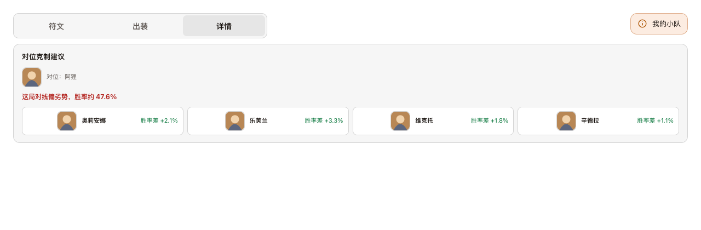
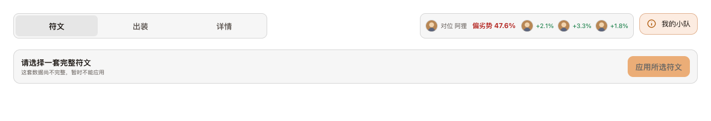
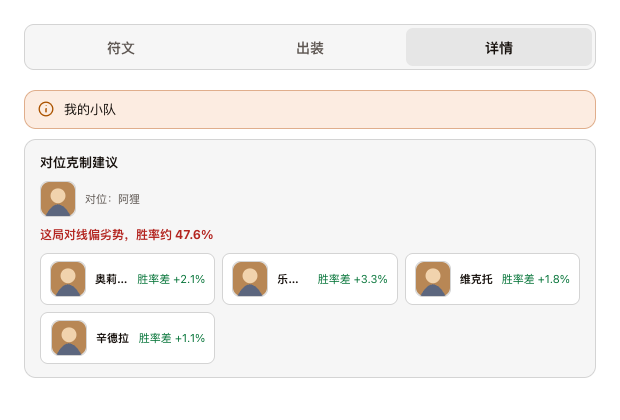
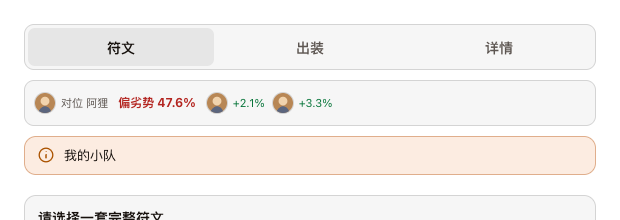

# R188 执行账本

日期：2026-10-02。基线：0.12.52；先按工单要求将 R186/R187 已验证的代码、测试及账本提交为 `3024a51d`，排除 R188 工单和用户原始验证目录。本轮版本 **0.12.53**；未发布 GitHub Release。

## P1：组队弹窗纯文字列表

| 工单项 | 实现与核对 |
|---|---|
| P1-1 / P1-6 | 全仓生产只有 `renderLivePremadeTag` 写入 `data-tooltip-roster`，`setupFloatingTooltips` 消费。roster 每项只有 name / champion，删除头像 URL 生成、头像 DOM 分支及 `.tooltip-roster-icons` 样式，没有保留兼容头像分支。 |
| P1-2 | 每人一行两列，名字左侧、英雄右侧；名字为 tooltip-ink、12px、600 字重、长名省略，英雄为 muted、12px、右对齐、不换行；行高 22px，间距 4px，去掉连接符。 |
| P1-3 | championId <= 0 留空，即使有 championName 或 pick intent 也不显示；随机 pending 也留空，不输出“未知英雄”或“英雄待确认”。 |
| P1-4 | session / both / lobby 标题“组队 N 人”，inferred 标题“预组队 N 人”；数字取实际完整组成员数。删除来源与最近战绩说明。既有标签“组队 ×N / 预组 ×N”保留。 |
| P1-5 | 名字继续调用原 maskedPlayerName，隐藏名字设置和本人规则保留。 |

## P2：推荐页签栏对位条

| 工单项 | 实现与核对 |
|---|---|
| P2-1 | 从 insight 内容移除；tab-row 固定顺序为 recommendation-tabs → data-lane-matchup-slot → rosterNotice。符文 / 出装 / 详情均可见。 |
| P2-2 | 改为单行：22px 敌方头像 +“对位 英雄名”、简写结果“偏劣势 47.6%”等、最多 3 个候选头像与差值。删除旧标题、前缀及候选说明。候选名字只进 aria-label、data-tooltip 和图像 alt。背景、边框、圆角与 tabs 一致；实际同为 46px（38px 按钮 + 两侧 3px 内边距 + 2px 边框）。颜色沿用 weak / strong，五五开用 ink。 |
| P2-3 | 行允许 wrap，notice 排在对位条之后；不足时 notice 下一行。超过 700px 的容器中，仅有对位条时页签按钮按容器宽度收缩，防止 820px 窗口下对位条提前换行；无对位条的按钮尺寸保留。 |
| P2-4 | 容器 <=700px 延续既有 tabs 全宽断点；对位条下面单独整行，第三个候选由 CSS 隐藏。调整宽度无需发请求或重绘节点，内容保持单行。 |
| P2-5 | laneMatchupContext、敌方锁定、候选 / 自己锁定条件及诊断去重逻辑保留。lane_matchup_card 增加固定 placement=tab-row；直发、runtime 发送者及 Go 请求结构 / 落盘白名单均同步，只允许该枚举。 |
| P2-6 | liveBodyChrome 比较前清空固定 slot 内容；updateLivePanels 只替换 slot 子节点，沿用图像复用及 prepareImages。页签、焦点、固定 slot 和无变化的面板保留；对位成功、变化、消失均不重建整行。 |

## 验证

- R188 新增 10 项 Node 行为测试覆盖工单 1–10：实际 tooltip DOM、direct / inferred / both / lobby、0 与负英雄 ID、名字打码、三个激活页签、候选数量、notice 顺序、pending→成功→InProgress 的节点引用和焦点、阶段及敌方锁定条件、实际诊断发送者。
- 相关前端回归 330 项通过（2.421 秒）。既有 R66 / R69 / R167 / R177 / R181 测试同步新的标题和位置语义，保留缓存、数据与显示条件断言。
- Go 专项 `TestR188|TestR181Diagnostics` 通过（1.184 秒）：真实 HTTP → 诊断日志链路保留 placement 和原字段，空值与任意未知 placement 不落盘。
- 两个独立只读复核分别检查 UI / 节点更新和诊断 / 变异证据，未发现明确缺陷或遗漏。
- `node --test backend/web/*.test.cjs desktop/*.test.cjs` 全量 1071 项：1070 通过、1 平台条件跳过、0 失败（301.078 秒）。日志 `/private/tmp/r188-full-node.log`。
- `go test ./backend -count=1` 全量通过（228.547 秒），随后 `go vet ./backend` 通过，`git diff --check` 通过。日志 `/private/tmp/r188-full-go.log` / `r188-vet.log`。

## 构建与收尾

完整 `DEEP_LEGENDS_KEY_MODE=public ./build-desktop.sh` 成功：1664 项 Go 测试五分片、后端 / installer 测试与 vet、Windows 后端交叉构建、NSIS 安装 / 卸载器、外层安装器、包内 runtime、指纹及 public 收据全部通过。日志 `/private/tmp/r188-public-build.log`。

- 版本：**0.12.53**；源码、后端及包内指纹一致：**0f0d7ea94d0e**。
- key mode：**public**，未嵌入 Riot Key；仅保留可识别的 `-public` 安装包名称。
- 安装包：`dist/desktop/Deep Legends Setup 0.12.53-public.exe`。
- SHA-256：`9379490d9d59db99ff4fb1a73cdc843b96615deb1cedb53dee7626aea65afd44`，与 `release-build.json` / `SHA256SUMS-public.txt` 一致。
- package / lock、AGENTS / CLAUDE、CHANGELOG 与索引已同步版本；R167 / R181 索引备注“对位克制移到页签栏由 R188 调整”。
- R188 修改保留在工作区；本轮仅提交了前置 R186/R187，没有推送或发布。用户原始验证目录未改动。

### 4 项变异：全部实际断言 FAIL

| 工单变异 | 实际失败 |
|---|---|
| 恢复头像渲染 | direct 两人组队 tooltip 的 img 数量断言失败。 |
| ID=0 仍输出 championName | 英雄列应为空的断言失败。 |
| 对位卡仍写入 insight | insight 不应含对位节点的断言失败。 |
| 数据更新重建整行 | pending→成功的页签按钮引用相同断言失败。 |

脚本 `/private/tmp/r188-mutants.cjs`；临时源码覆盖与失败输出 `/private/tmp/r188-mutants/`。四次均为对应行为的 ERR_ASSERTION，无语法 / 导入错误，生产源码未改回错误实现。

## 改前 / 改后截图

`desktop/r188-layout.cjs` 使用真实 Chromium、生产 renderer / tooltip / CSS，注入演示玩家和排位数据；图标使用本地 SVG 演示占位，不代表真实英雄图像。改前源码从基线保存在 `/private/tmp/r188-before/`，改后使用当前源码。旧版为显示旧卡切到详情，新版停在符文；宽 / 窄分别 1280 / 620px，100% 缩放。另验证 960 / 820px 同排、notice 在 820px 换行，620px 对位条全宽且仅 2 候选。所有宽度无页面或对位条溢出，可见头像均 22px，对位条与 tabs 等高。

| 场景 | 改前 | 改后 |
|---|---|---|
| 组队弹窗 |  |  |
| 对位宽屏 |  |  |
| 对位窄屏 |  |  |

几何证据：`docs/history/reports/r188/before-layout.json` / `after-layout.json`；浏览器日志 `/private/tmp/r188-layout-before.log` / `r188-layout-after.log`。可复现：`node desktop/r188-layout.cjs`；旧版加 `R188_BEFORE=1 R188_SOURCE_DIR=/private/tmp/r188-before`。

## 日志核对与真机边界

按 R188 工单所附 `lol-loot-diagnostics-1002-1919.jsonl` 的诊断摘要：0.12.49 已有 R182 灵活组排负局 -18，baseline_source=game_start / games_gap=1 / losses_delta=1；后续胜局 +17；本人最新对局及对位卡也有正常事件。原始 JSONL 未在当前工作区提供，本轮不声称独立重读确认；这份新增工单证据更新了 R187 执行时“负局尚无样本”的历史状态。

该日志仍为 0.12.49，不能验证 R185 新性能埋点、R186 设置同步 / 更新和 R187 缓存修复；仍需新版日志。工单列出的空白战利品结算、偶发图片排队未列入本轮修改。

本机未连接 Windows 真实游戏客户端。用户待验：安装 0.12.53，悬停组队标签确认纯文字列表和空英雄列；敌方同路锁定后，停在符文也能看到右侧对位条；导出新版日志核对 placement=tab-row。
