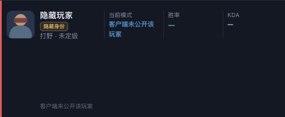
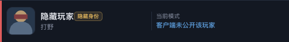
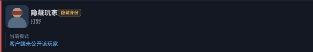

# R193 执行账本

日期：2026-10-02。R192 基线已提交 `a175718b`，版本由 0.12.56 递增至 **0.12.57**。

## 逐项实现

| 工单要求 | 实现及验证 |
|---|---|
| 隐藏玩家不显示段位，无位置时不显示副标题 | `renderLivePlayer` 对 `hidden === true` 只输出位置；没有位置返回空串。即使夹具携带 rank 也不显示段位。R193 Node 第 1 项通过 |
| “客户端未公开该玩家”只出现一次，底部不留空行 | 保留统计区，`renderInsightMatches` 对隐藏玩家直接返回空串。第 2 项通过；实际 Chromium 确认无底部节点、下一张卡片间距为 0 |
| 无统计时整列省略胜率/KDA | 只保留当前模式统计块，没有破折号和对应列节点。第 3 项通过；统计存在时仍保留两列 |
| 身份待公开、隐藏战绩、普通无样本显示保持 | 第 4 项与 `a175718b` 的三种组合 HTML 快照逐字比较通过，保留“身份尚未公开”。基线快照位于 `backend/testdata/r193-identity-cards-before.json`，运行测试无需 Git 历史 |
| 普通无段位玩家保留“未定级” | 第 5 项通过。不增加 UI 文字 |

匿名恢复、身份、段位和战绩查询等 Go 代码均未修改，R175/R183 安全路径保持原样。隐藏玩家名称按钮仍禁用，英雄图标节点保留。

删除历史行会让旧双队共享 subgrid 将后续卡片放到错误的行。CSS 仅在详情、非竞技场且存在隐藏玩家时改为各队独立排布，避免缺行造成错位和空白高度。没有隐藏玩家继续使用原布局。仅剩一个统计块时跨满统计网格，避免提示被三列模板挤压。

R164 原断言要求隐藏玩家底部再次输出提示，按新要求改为空串。R179 旧固定 HTML 要求无位置的隐藏玩家显示“位置未知 · 未定级”和两列破折号，按 R193 更新快照；选人阶段敌方占位、己方显示和其他护栏继续保留。初轮全量由这条旧快照断言失败，已停止两个过期批次，再运行最终全量。

## 测试与变异

最终专项 `node --test backend/web/r193.test.cjs backend/web/r164.test.cjs backend/web/r179.test.cjs`：**18/18 通过**。R193 自身 **5/5 通过**。

`python3 desktop/r193-mutants.py`：两个变异均触发预期断言失败，未以语法错误或缺依赖充数。

- 隐藏副标题恢复普通 rankCopy：第 1 项 FAIL。
- 恢复隐藏玩家底部行：第 2 项 FAIL。

记录：`history/reports/r193/mutations.json`；专项日志 `/private/tmp/r193-target-node-final.log`。

最终 `node --test backend/web/*.test.cjs desktop/*.test.cjs`：**1100 项，1099 通过、1 项平台条件跳过、0 失败**（273.7 秒），日志 `/private/tmp/r193-node-final-green.log`。最终三状态基线夹具改为独立 JSON 后，专项 18 项再次通过，两个变异再次被杀死。

工单要求的原命令 `go test ./backend -count=1`：**通过，233.158 秒**，日志 `/private/tmp/r193-go-full.log`。完整构建内的 Go **1686 项**五分片再次全部通过（84.7 秒），backend vet、installer 全量测试及 vet 通过。`git diff --check` 通过。

独立只读复核未发现实现缺陷；复核代理在沙箱内无法监听本地端口，浏览器验证由主线程通过已批准的本地 Chromium 调用完成。

## 演示截图

`node desktop/r193-browser.cjs`：真实生产 index.html、CSS 和前端脚本，从对局页点击详情。仅 API 响应使用演示夹具，设置灵活组排 InProgress、一个无 Riot ID / playerRef 的对方打野隐藏玩家。改前加载 `a175718b` 的 gameplay.js / gameplay.css，改后加载当前源码。

宽度 1280：改前副标题为“打野 · 未定级”、提示 2 次、统计 3 列；改后为“打野”、提示 1 次、统计 1 列、无底部战绩行，后续卡片没有错行。宽度 760 同样通过，下一张卡片间距为 0。页面异常集合为空，按钮禁用、演示头像完成加载。

截图、姓名和头像均为演示夹具；头像是本地 SVG 示意图，不是 Riot 英雄素材，不代表 Windows 真机实测。测量见 `history/reports/r193/browser.json`。

改前：

改后：

窄屏：

## 构建

`DEEP_LEGENDS_KEY_MODE=public ./build-desktop.sh`：**完整通过**，版本 **0.12.57**、key mode **public**。NSIS、安装器封装、打包运行时验证、后端和打包指纹、收据与校验表均通过。

- 安装包：`dist/desktop/Deep Legends Setup 0.12.57-public.exe`。
- 指纹：`8178e5d871e0`；最终重新计算源码指纹并校验后端一致。
- 安装包 SHA256：`8792fdaf670e7946ebe5edfa638c4c1d4778123e28ea8b1fb7c11ee72bb7c070`。
- 后端 SHA256：`aed95f2ccf3ea18a02cb689a018befd541ae310c54a74af5766cc247f1047161`。
- 重新计算 SHA256 与收据一致；收据/校验表归档 `history/reports/r193/release-build.json`、`SHA256SUMS-public.txt`。
- 构建日志：`/private/tmp/r193-public-build.log`。仅保留带 `-public` 后缀的安装包。

## Windows 待验

下次遇到隐藏身份玩家时确认：显示英雄头像、“隐藏玩家”和位置；没有“未定级”；“客户端未公开该玩家”只出现一次，无数据时没有胜率/KDA 占位列。此前 R190/R191/R192 的真机待验项目仍以各自账本为准。
