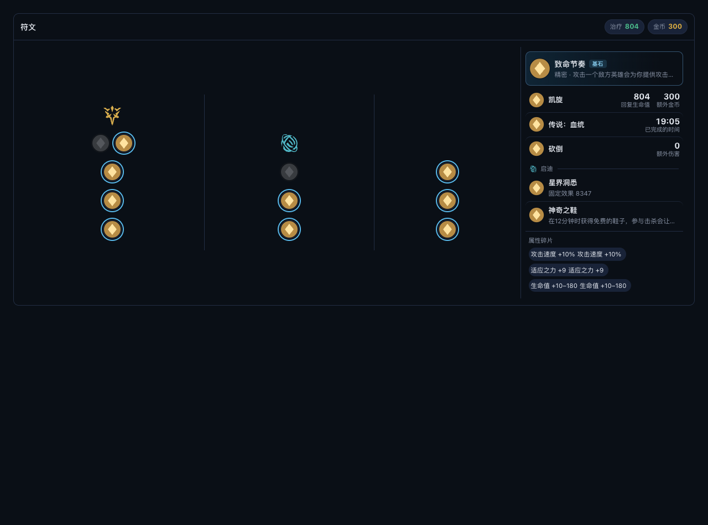
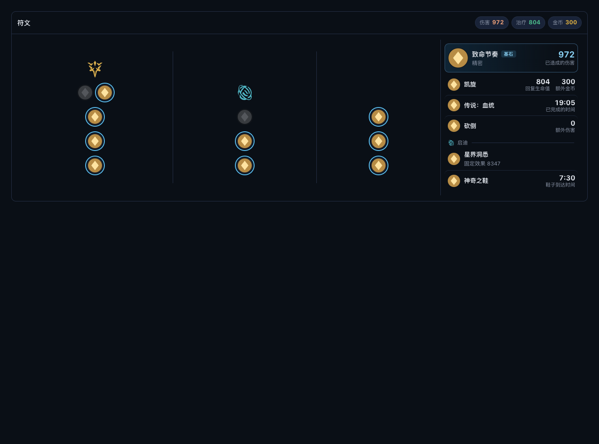
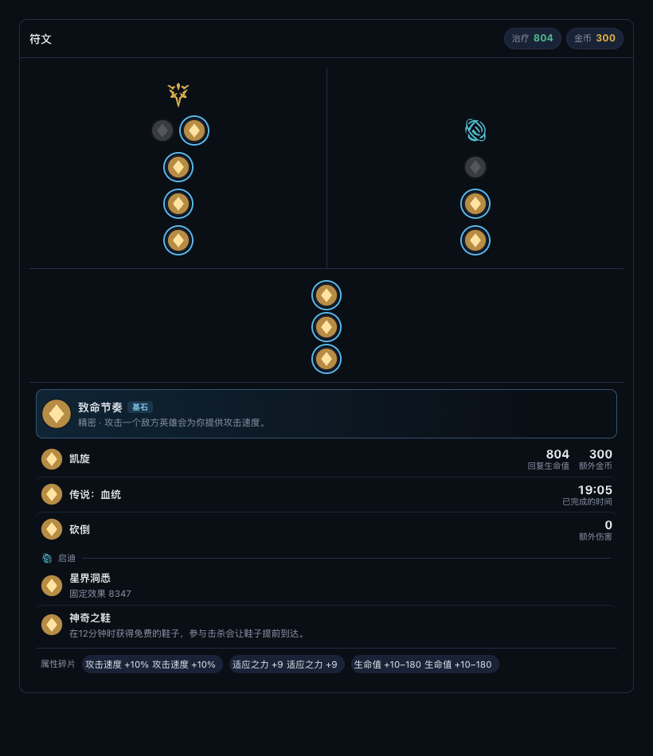
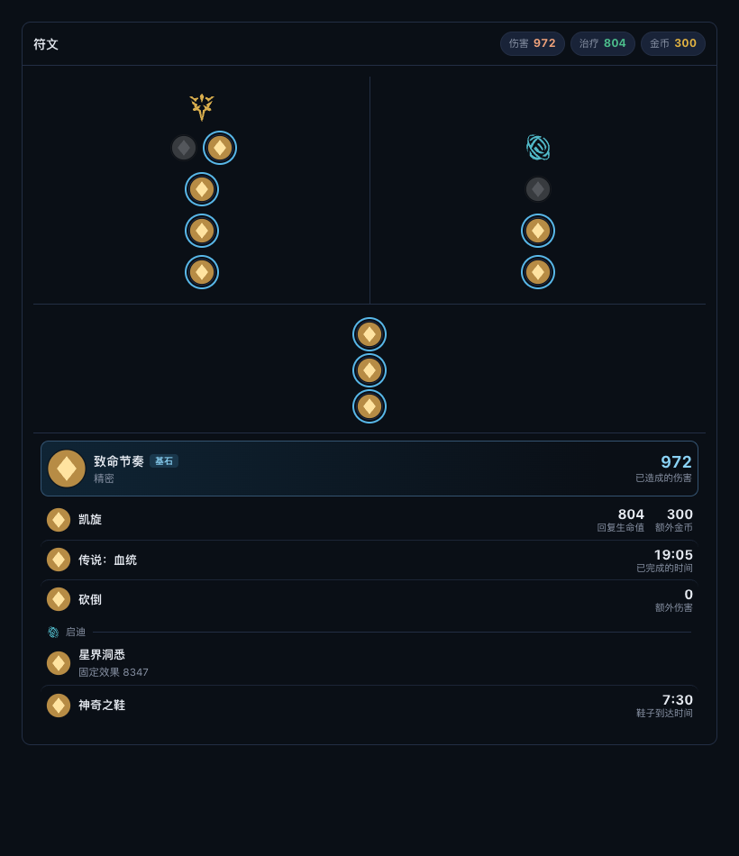
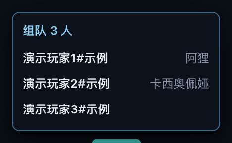
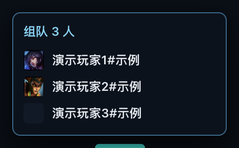

# R195 执行账本

版本：0.12.59。工单：[R195](WORKLIST-R195-RUNE-EFFECTS-KEYSTONE-VALUES-NO-SHARDS-PREMADE-ICONS-UPDATE-DETECTION-AND-INDEX-CLEANUP.md)。

## 实现与覆盖

| 工单项 | 完成情况 |
| --- | --- |
| P1 碎片 | 删除效果区碎片 DOM 与 CSS；共享符文板保留。 |
| P1 致命节奏 | 8008 仅显示 var2 的已造成伤害，计入头部伤害汇总。样本 `[932,972,0]` 显示 972。 |
| P1 神奇之鞋 | 删除 8304 覆盖，客户端三变量时间模板显示 7:30；非法分钟或个位数字丢弃。 |
| P1 基石 | 44px 图标；有数值时副标题仅系名，18px 主题色数值；无数值保留描述。 |
| P2 组队 | 20×20、4px 圆角头像位于名字前，间距 8px；仅代理 URL、现有图片队列；未选英雄留占位，隐藏名字仍打码。 |
| P3 安装识别 | 去空白和引号、Clean、Windows 长路径、EvalSymlinks 后比较；失败保留原值。默认目录有卸载程序时兜底 installed；便携环境优先。 |
| P3 诊断 | 增加七项布尔值/计数，不记录路径；保留原始与规范化匹配结果供排障。 |
| P4 索引 | 按用户确认关闭旧工单并注明接手关系；仅 R153、R156、R195 进行中；已关闭工单/账本归档，修复相对链接。映射见 [归档清单](history/reports/r195/index-cleanup.json)。 |

## 自动验证

- Node 专项：32/32 通过；R195 九项断言包括数字、模板、布局、头像、占位和打码。
- 四项变异均由指定断言检出，见 [变异报告](history/reports/r195/mutations.json)。
- Go 专项：`go test ./backend -run '^(TestR195|TestR186InstallDetection|TestUpdate)' -count=1` 通过；覆盖引号、斜杠、注入短路径转换、默认目录兜底、不同目录和诊断隐私。
- Chromium 演示：改前与改后宽/窄符文布局及组队弹窗通过；真实图片队列加载两个本地英雄头像、一个占位。
- 完整 Node：1111 项，1110 通过、1 项需 Windows/PowerShell 而跳过，0 失败（255.314 秒）。
- 完整 Go：`go test ./backend -count=1` 通过（228.647 秒）；`go vet ./backend`、`git diff --check` 通过。
- 本地完整 public 构建通过；版本 0.12.59，收据和从 Git 快照计算的源码指纹均为 `628380d1c65b`，打包运行时及 public 密钥策略通过。详见 [验证记录](history/reports/r195/verification.json)。
- GitHub Windows 发布构建和完整 CI 全部 success；quality 包括全量 race、前端/desktop 回归、真实 Chromium 图片队列和懒加载 CSS 门禁。Windows Web 843/843，desktop 268 项、266 通过、2 项非 Windows 门禁跳过，0 失败；public 运行时、指纹、收据和密钥策略均通过。Windows 发布构建 Go 全量 176.454 秒，清单/收据专项 4/4、更新专项通过。

## 演示截图

截图使用演示玩家和符文数据，不代表 Windows 真机验收。英雄头像来自仓库资源；符文小图使用演示素材。

| 场景 | 改前 | 改后 |
| --- | --- | --- |
| 符文宽屏 |  |  |
| 符文窄屏 |  |  |
| 组队弹窗 |  |  |

## 发布与升级边界

源码提交 `ca7ca4857162fbe8b2559138a7ca2b2fe21f90d0`，分支 `codex/release-0.12.59`。已完成 [Windows public 发布构建](https://github.com/LLYY0418/Deep-Legends/actions/runs/37052834087)；[完整 CI](https://github.com/LLYY0418/Deep-Legends/actions/runs/37052832986) 的 quality 与 windows-build 全部通过。

GitHub 草稿 ID `402098152`，三附件已回下载并经独立只读复核；实际字节与 API digest、size、SHA256SUMS、manifest、CHANGELOG 一致。完整 CI 通过后已正式发布。

| 附件 | 大小 | SHA256 |
| --- | --- | --- |
| Deep-Legends-Setup-0.12.59-public.exe | 111334912 | `8e021a2cfaf484b7509d88bdc014cb78e515c5432c2f9ba977b6adf68276f568` |
| latest.json | 881 | `bca82565960d4d480bf23119729511745140007a6ec69a8d969e52c5d459043f` |
| SHA256SUMS-public.txt | 182 | `60217bfe120036651c56cbe8aca3eeeb9b02b3f3224786f31ca85fcfdac47a36` |

[清单](history/reports/r195/latest.json)、[校验表](history/reports/r195/SHA256SUMS-public.txt)、[附件核验](history/reports/r195/draft-verification.json) 已归档。完整安装包只保存在忽略目录 `dist/github-release-0.12.59-public/`，未进 Git。本地 macOS 交叉构建哈希与 GitHub Windows 实际构建分别记录，正式发布使用上表 Windows 附件。

正式发布版本保留公开历史记录；新版本接替 Latest，不删除旧版本或改回草稿。

已正式发布 [v0.12.59](https://github.com/LLYY0418/Deep-Legends/releases/tag/v0.12.59)，release id `402098152`，发布时间 `2026-10-02T19:41:08Z`（北京时间 10 月 3 日 03:41），draft=false、prerelease=false、isLatest=true。`refs/tags/v0.12.59` 指向上述构建提交。匿名 `releases/latest/download/latest.json` 字节与回下载清单完全一致；三个正式附件 digest/size/下载 URL 和正文复查通过。见 [正式发布核验](history/reports/r195/published-release.json)。

旧 v0.12.58 仍公开，release id `402019897`、三附件 digest/size 不变，只让出 Latest；v0.12.49、v0.12.50 原草稿未改动。标签自动触发的重复草稿构建 `37055719259` 已确认 cancelled；同源码原发布构建已成功，禁止替换已发布附件。标签 CI `37055719278` 保留自动执行，验收采用同源码已全部成功的 `37052832986`。后续账本提交不移动版本标签。

0.12.50：旧 R185 账本声称正式发布的 Release ID `401671502` 现返回 404；当前 v0.12.50 为另一个草稿记录 `401679319`，创建于 2026-10-02 09:04:27 UTC，未正式发布。现有证据无法确定旧记录删除时间、操作者，或旧账本 ID 是否有误。已在 [R185 账本](history/ledgers/r185-execution-ledger.md) 更正当前状态，不推断原因。

0.12.58 → 0.12.59 使用 0.12.58 内的旧安装位置判断，可能仍失败。失败时使用发布页手动安装一次 0.12.59；之后升级使用本工单修正后的判断。自动测试和构建不替代这一次实际升级。

## 用户真机验收（待完成）

1. 在 0.12.58 检查更新，验证 0.12.59 的立即升级、下载、重启升级；失败时手动安装。
2. 带致命节奏的真实对局详情显示伤害数值，效果区没有属性碎片。
3. 选人或对局的组队弹窗显示头像加名字。
4. 导出日志，核对 `update_install_detection result=installed`；仍 mismatch 时使用新增诊断字段继续定位。

R195 因以上真机验收保留进行中。
