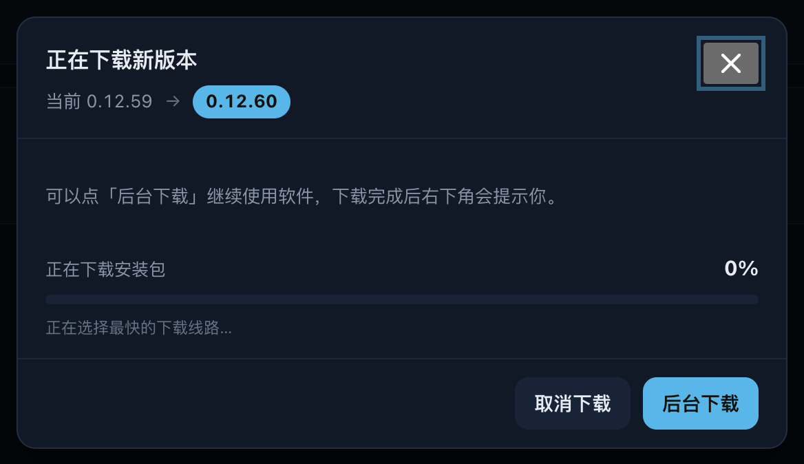
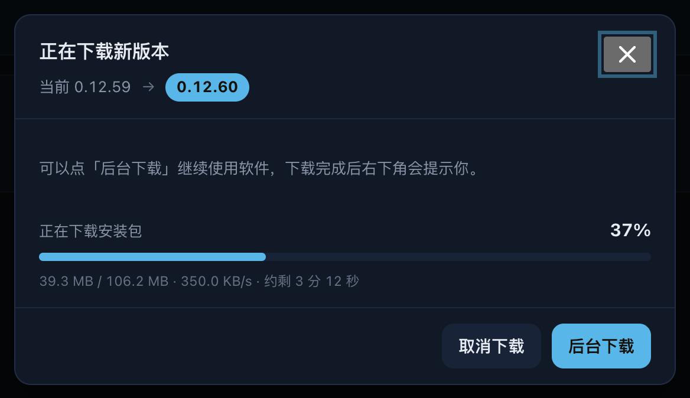
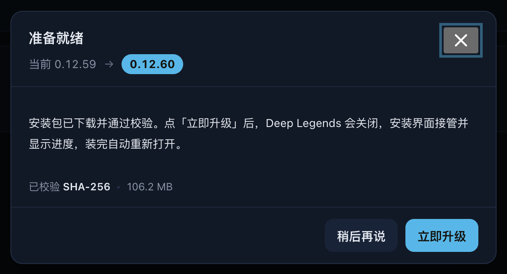

# R196 执行账本

日期：2026-10-03。版本 0.12.60。基线 0.12.59（R195）；工单：[R196](WORKLIST-R196-UPDATE-DOWNLOAD-SOURCE-RACE-ETA-FORMAT-BACKGROUND-DOWNLOAD-TOAST-AND-THINNER-BUTTON.md)。

## 逐项实现

| 工单项 | 实现与验证 |
| --- | --- |
| P1-1/2 并行测速 | 内置直连和三镜像始终参与，与自定义前缀去重；每条 GET 前 1MB、Range `bytes=0-1048575`、独立 6 秒上限。仅接受合法 206 总长度或 200 Content-Length；响应体丢弃，不写 `.part`。超时、短响应和错误页长度不符判不可用。 |
| P1-3/4 选线续传 | 可用线路按实测速度排序。保留原 8 秒无数据保护、HEAD 探测、Range 与前缀 SHA256。满 15 秒后最近 10 秒低于 150KiB/s，切至下一条未用可用线路；全部测速线路都慢时留在最快的线路，不反复切换。测速全失败则按候选顺序逐条回退。原校验和失败的第二轮重试保留，每轮每条最多一次。 |
| P1-5 线路记忆 | `preferredSource` 只保存成功前缀；清单或安装包成功都更新。下次检查优先；并行测速的候选顺序及同速排序优先。旧设置缺字段兼容，用户镜像列表不因内置线路合并而改写。 |
| P1-6 诊断 | check 成功附实际 `mirror_prefix`；新增 probe/selected/switched/finished/failed/cancelled、proxy_env 事件。前缀只记录 scheme+host；不记完整 URL、路径、代理值。缓存命中成功的 mirror_prefix 为 cached。速度单位 KiB/s，finished duration 包含测速，avg 为实际传输字节/总时长，resumed_bytes 为任务开始前已有 partial 字节。 |
| P2 ETA | 秒、分秒、小时分钟三档；零速度继续显示连接提示；测速显示“正在选择最快的下载线路…”。 |
| P3-1/2/3 后台下载 | downloading/verifying 仅取消下载和后台下载；后台或 × 只关闭窗口。顶部 busy 圈、实时百分比及重开进度保留；说明替换为工单文案。 |
| P3-4/5/6/7 完成卡片 | ready 且窗口未打开时显示右下角持久卡片，320px、右/下 20px，每个版本每次运行一次。稍后只关卡片；顶部打开 ready 窗口且不重下。卡片升级先获取 phase；选人/对局或 phase 请求失败时打开窗口，留给用户确认；原窗口二次确认流程保留。所有主按钮统一“立即升级”。 |
| P3-8 提醒 | 专用可信 IPC，主进程仅在最小化或失焦时 flashFrame(true)，焦点恢复停止；窗口关闭移除监听。不使用系统通知。ready 时窗口正开着也可提醒任务栏。 |
| P3-9 重启恢复 | 后端已持久化 manifest 并在 Start→Check 校验磁盘完整安装包后恢复 ready；新增新实例启动与状态广播测试。前端首次 ready 快照也弹一次卡片。 |
| P4 图标 | 与 `--control-icon-size` 同尺寸；六边形/进度 1.6，箭头 1.8；ready 仅描边且保留右上红点。 |

## 验证

- Go 工单七项下载专项通过，另补自定义线路保留内置四线和重启恢复 ready 两项。
- 下载/更新专项 race 通过；现有更新测试继续覆盖校验重试、HEAD/Range、取消、忙状态、磁盘空间和安装判断。旧 fixture 明确模拟拒绝测速 Range 的服务器，以验证全失败回退；新 R196 fixture 独立运行真实测速请求。
- Node 工单七项（8–14）与已有更新界面回归 20/20 通过；桌面可信 IPC 实际执行 preload→ipcRenderer→ipcMain→flashFrame/focus 路径，通过。
- 五项 overlay 变异均由指定断言检出，见 [变异记录](history/reports/r196/mutations.json)。没有以编译/语法失败冒充断言失败。
- 独立只读复核后端、前端、桌面完成；重启场景测试缺口已补。
- Chromium 演示截图通过宽高、描边、fill、按钮、ETA、卡片距离及无横向溢出断言；主代理已查看截图。
- 完整 Node：1119 项，1118 通过、1 项 Windows PowerShell 门禁在 macOS 跳过，0 失败；耗时 241.691 秒。
- Go 隐私写入门禁识别了新增的线路偏好落盘点；已归入既有自动更新设置声明，并登记 `update_sources.go` 的一次 `update-settings.json` 写入，不新增账号采集或隐私 UI 文案。
- 最终 `go vet ./backend` 与 `git diff --check` 通过；后端全量、public 构建与 GitHub CI / 发布执行中，收尾补齐结果。

## 演示截图

使用演示下载状态；不是 Windows 实际网络或安装验收。渲染器、DOM 和样式来自实际代码，其他已存在的按钮样式保持原样。

| 场景 | 演示截图 |
| --- | --- |
| 测速中 |  |
| 下载中 |  |
| 下载完成卡片 |  |
| 准备就绪窗口 |  |
| busy 按钮改前 |  |
| busy 按钮改后 |  |
| ready 按钮改前 |  |
| ready 按钮改后 |  |

## 发布与真机边界

按工单发布 0.12.60 public Release Latest，附安装包、latest.json、SHA256SUMS，保留所有旧正式版本及原草稿。key mode 为 public，不含个人 Riot Key。正式版本标签指向实际验证的构建提交，后续账本提交不移动标签。

**0.12.59 → 0.12.60 的下载仍由 0.12.59 旧逻辑执行，可能直连优先而很慢；测速选线从 0.12.60 开始的下一次升级才生效。** 本次慢时可取消，从发布页手动下载安装。R195 的安装位置修正已在 0.12.59，仍需用户验证自动安装和重新打开。

仍需用户真机验收：本次从 0.12.59 安装并重开；0.12.60 的下一次升级验证测速、ETA、后台完成提示、任务栏闪烁与稍后后直接升级；导出日志核对 probe/selected/finished 与 installed。自动测试、演示 Chromium 和 Windows runner 构建均不等同于上述真机验收，R196 保留进行中。
