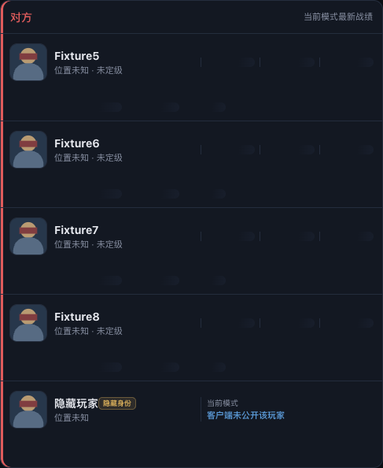
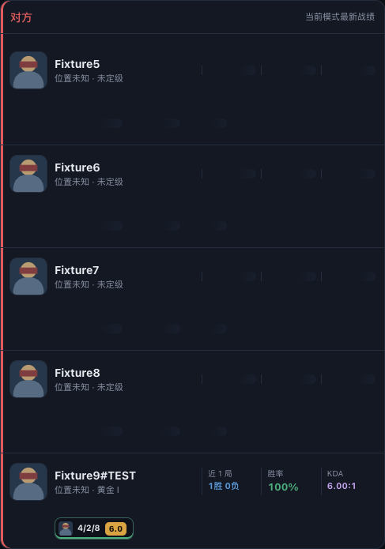

# R197 执行账本

日期：2026-10-03。合并版本 0.12.61。基线 R196 `e3ba8b6fe58cfb1c188bedaa75ca82c307fe70b4`。R198 取代并扩展 P2 仅核对的范围，保留其测试与诊断。

## 逐项实施

| 项目 | 实现与证据 |
| --- | --- |
| P1-1 触发与同局快照 | WaitingForStats 保留原 10 人快照，PreEndOfGame/EndOfGame 启动一次；初始以及每次重试核对 gameflow session gameId，拒绝旧局。结束阶段和大厅返回保留快照。 |
| P1-2 同源详情 | 复用总览 `loadDetailedMatches` 与已有缓存：国服官方 SGP 页及 LCU history detail 回退；只失效本人对应 history 缓存。没有新增观战、第三方身份接口或国服 Riot 直查。 |
| P1-3 匹配 | 队伍 + 英雄唯一匹配；排除已有 PUUID；要求姓名和 PUUID，详情仍隐藏、无候选、歧义均保留隐藏卡。测试刻意打乱详情顺序。 |
| P1-4 普通卡片 | 复用普通资料、段位、近期战绩、位置与匿名 playerRef 注册流程；排位按队列，乱斗无虚假段位；保留原英雄/队伍。名字可点总览，无新说明和标记。 |
| P1-5 重试与取消 | 结束后绝对 10/40/120 秒，最多三次；新 ChampSelect/活动对局、其他 gameId、断线取消，generation 与 context 阻止旧任务写回；phase 轮询也处理漏掉的活动阶段。资料 HTTP 支持 context 取消。 |
| P1-6 对局阶段 | InProgress/Reconnect 不加载赛后详情或身份，保留既有隐藏卡。 |
| P1-7 诊断 | live_roster_post_game_reveal 包含 game_id、queue_id、attempt、hidden_count、revealed、reason；覆盖工单七种 reason，不记录姓名/PUUID。 |
| P2 同步测试 | CameraMode 开局 2、结束 0、LCU 2，差值 PATCH 仅一字段并 GET 核对 result=ok；R186 同步和 R198 下一局覆盖均覆盖。 |
| P2 诊断 | game_settings_sync 增加 camera_mode_before/after，保留原同步逻辑与 save 探测；无关值记 unknown。功能扩展见 R198。 |

## 自动验证

- 工单七项 Go 与额外重试中 gameId 变化、活动阶段/断线取消、队列段位、已有 PUUID、空姓名等边界已覆盖；Node 两项卡片断言和 SSE 桥接通过。
- 三项 overlay 变异均由指定断言检出，见 [mutations.json](history/reports/r197/mutations.json)。
- 独立只读后端/前端复核完成；逐次 gameId 校验缺口已修正。损坏 JSON 的复核疑点经原文核对已有 json.Valid 守卫，新增截断/空输入测试通过。
- 完整 Node 1124 项，1123 通过、1 项 Windows PowerShell 门禁在 macOS 跳过、0 失败（273.085 秒）。最终 Go 243.758 秒通过，专项 race 3.723 秒通过、vet 与 diff check 通过；完整 public 构建 1725 项 Go 分片、installer test/vet、Windows 安装壳、包内后端、密钥策略与运行时验证通过。指纹 `983e425a16cd`，见 [verification.json](history/reports/r197/verification.json)。

## 演示截图

实际生产 HTML/CSS/JS + Go 专项生成的匿名合成响应。真实本地 SSE → app 桥接 → 赛后事件 → loadLive → 完整卡片更新 → 点击名字走总览请求；主代理已查看补全前后截图，不代表 Windows 真实对局验收。

补全前：

补全后：

## 发布与真机边界

发布未完成。按 R198 与 R196 合并为 0.12.61 public Latest，旧 0.12.60 草稿保持原样。正式发布后必须回填 release id、isLatest=true 查询和匿名 latest.json 版本。

仍需用户 Windows 真机验收：隐藏玩家出现的对局结束后停在对局页 1～2 分钟，卡片补全；进行中仍隐藏。导出 live_roster_post_game_reveal 和 game_settings_sync 日志。R197 保留进行中。
