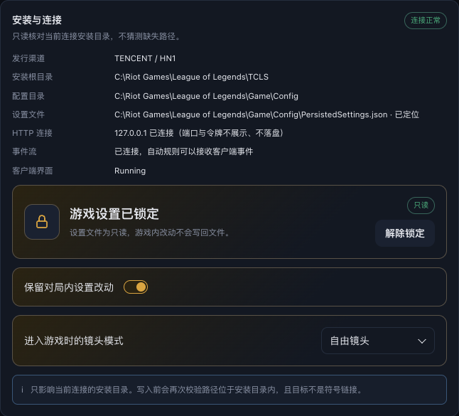

# R198 执行账本

日期：2026-10-03。合并版本 0.12.61。R198 取代并扩展 R197 P2，R197 同步测试/诊断保留。包含未正式发布的 R196 改动。

## 逐项实施

| 项目 | 实现与证据 |
| --- | --- |
| P1 设置 | 工具 → 维护 → 安装与连接，保留对局内设置改动下面增加进入游戏时的镜头模式。四选项不修改/自由/动态/锁定，默认不修改，选择立即保存；与保留设置共用 game-settings-sync.json，互不覆盖。只读时仍可选，不加说明。 |
| P2-1 时机 | ChampSelect 一次，GameStart 再核对；大厅选择只应用 LCU；InProgress/Reconnect 无写入，每步重新核对阶段和连接。 |
| P2-2 LCU | GET → 仅 General.CameraMode PATCH → GET 核对；成功才按 OpenAPI 安全探测调用 save。已相同不 PATCH。与 R186 共用写锁。 |
| P2-3 文件 | 仅 ChampSelect/GameStart 且游戏进程未运行；双文件只替换 CameraMode 数字原字节，JSON 格式顺序/INI CRLF/其他设置保持。临时同目录文件、Sync、原子 Rename、读回全文核对。写前二次校验路径、同文件身份、原字节、权限，无符号链接、必须安装目录内。 |
| P2-4 只读 | 两文件只读跳过，LCU 照常；file_result=read_only、file_skipped=read_only。 |
| P2-5 优先级 | R186 结算可保留手动镜头，下一局按下拉覆盖；共享存储和写锁避免互相覆盖。 |
| P2-6 失败 | 不重试、不弹应用失败窗口，只记日志；偏好保存失败才反馈无法保存。 |
| P2-7 不修改 | 在 LCU 和文件读取前返回，零额外读写。 |
| P3 映射 | 本地日志、现有 LCU schema/设置和代码检索只确认 locked=2，未找到自由/动态权威枚举。集中表 free=0,dynamic=1,locked=2，**按选项顺序推断，待用户真机核实**。可单表调整。 |
| P4 诊断 | game_camera_mode_apply 的 stage/target/target_value/lcu_before/after/result/file_before/after/result/save_called 完整，无路径账号；file_skipped 标识只读/游戏进程等。in_game_60s 仅选择非 none 时加 camera_mode_matches_target，同时比较 LCU 与可读本地文件的实际值。 |

Windows 使用已有原生进程检测确认 League of Legends.exe 是否运行；检测失败和非 Windows 无法确认时保守跳过文件写入。CameraModeWASD 始终不动。原隐私自动写入清单已补充实际 CameraMode 写入声明，与实现一致。

## 自动验证

- 工单九项 Go、R197 单字段同步及下一局覆盖、大厅/实际游戏进程/verify failure/持久化/写前并发锁定改写或 symlink/60s 文件回改等测试通过。截断/空 JSON 被 json.Valid 拒绝；读回核对最终字节。
- 四项 overlay 变异均由指定断言检出，见 [mutations.json](history/reports/r198/mutations.json)。独立只读后端/前端及发布产物复核通过。
- Node 2 项覆盖四选项、默认、立即保存、重新加载保持、只读可选、保存失败回滚；真实 Chromium 使用生产 UI 与演示 API 验证整页刷新保持。
- 最终完整 Node 1125 项、1124 通过、1 项 Windows PowerShell 门禁在 macOS 跳过、0 失败（251.037 秒）；Go `go test ./backend -count=1` 243.758 秒通过；专项 race 3.723 秒、vet、diff check 通过。
- 完整本地 public 构建再次通过：1725 项 Go 分片、installer test/vet、Windows 安装壳、包内后端、密钥策略与运行时门禁。源码、Git 快照和安装包内后端指纹均为 `3a9d539dfb84`。
- GitHub 完整 CI 成功：全量 race 206.587 秒；Node 1125 项、1124 通过、1 跳过、0 失败（367.601 秒）；R100/R117 真实 Chromium、installer 与 embedded pool 门禁通过。Windows CI Go 238.048 秒、Web 856/856、desktop 269 项、267 通过、2 跳过、0 失败；校验和和产物上传均成功。
- 源码提交 `302ca108139353df23fa03e9d00132a6c3d59eea`，分支 `codex/release-0.12.61`。[完整 CI 37109826915](https://github.com/LLYY0418/Deep-Legends/actions/runs/37109826915)、[Windows public 发布构建 37109827925](https://github.com/LLYY0418/Deep-Legends/actions/runs/37109827925)。后续账本提交不移动版本标签。
- 汇总见 [verification.json](history/reports/r198/verification.json)。

## 维护页演示

真实生产页面，演示数据文件为只读，选择自由镜头并刷新保持；无新增解释文字。主代理已查看维护页截图，见 [browser.json](history/reports/r198/browser.json)。

## 发布与真机边界

Windows public 发布构建成功：全量 Go 319.256 秒；Web 856/856；desktop 269 项、267 通过、2 项平台门禁跳过、0 失败；发布运行时 4/4，public 密钥/包内后端/指纹校验通过。草稿 id `402418510`，三个附件回下载 SHA256/size/digest/清单均通过，安装包 111,362,560 字节，SHA256 `d5430f8837aed465ebe6575ab1972fafb68d3529bc856e760b38b09b6763a71b`。旧六个 Release 的元数据与附件保持不变，包含 0.12.60 草稿；独立产物复核通过。证据见 [草稿核验](history/reports/r198/draft-verification.json)。

已正式发布 [v0.12.61 Latest](https://github.com/LLYY0418/Deep-Legends/releases/tag/v0.12.61)，release id `402418510`，发布时间 `2026-10-03T08:57:22Z`（北京时间 16:57:22），draft=false、prerelease=false、**isLatest=true**。匿名 `releases/latest/download/latest.json` 得到 **0.12.61**，与回下载清单字节一致；标签指向 `302ca108139353df23fa03e9d00132a6c3d59eea`，正式附件 digest/size/下载 URL/正文核对通过。包含 R197/R198 和 R196 下载测速选线、ETA、后台完成提示及细按钮。key mode=public，不含个人 Riot Key。旧六个 Release 元数据和附件不变，0.12.60 草稿仍保留未发布。证据见 [正式发布核验](history/reports/r198/published-release.json)。

标签自动触发的同源码 CI `37111418872` 保留自动执行；验收采用同源码已全部成功的 `37109826915`。标签触发的重复草稿构建 `37111418886` 已确认 cancelled，不改已发布附件。

仍需用户 Windows 真机验收：选择自由镜头连续开两局，进游戏不操作，Esc 选项确认为自由；导出 game_camera_mode_apply（第一局 ok、后续 unchanged）及 in_game_60s camera_mode_matches_target=true。0/1 尚待真机确认，不将自动测试或 Windows runner 构建当作用户验收。R198 保留进行中。

## 2026-10-03 用户追加要求覆盖

用户明确要求移除“保留对局内设置改动”，镜头模式移到右侧维护按钮区。0.12.62 已删除旧结算自动同步及其接口，旧镜头选择继续保留；原工单涉及保留设置同步/紧邻旧开关的要求由此次用户要求覆盖，不再执行。R184 只读诊断、R198 开局镜头和原 Windows 验收边界保留；后续不再要求导出 game_settings_sync 事件。本地 public 构建完成，未发布 0.12.62，详情见 [追加要求账本](history/ledgers/maintenance-overview-1003-execution-ledger.md)。

## 2026-10-03 用户追加 save 探测修正（并入 R200）

镜头保存先读取 `/help`；未列出时探测一次 POST `/lol-game-settings/v1/save`，404/405 仅记 unsupported，不报错。不依赖 swagger。模拟与既有镜头回归通过，已并入 0.12.63 正式 Latest，发布证据见 [R200 账本](r200-execution-ledger.md)。真机镜头效果仍保留原验收边界。
