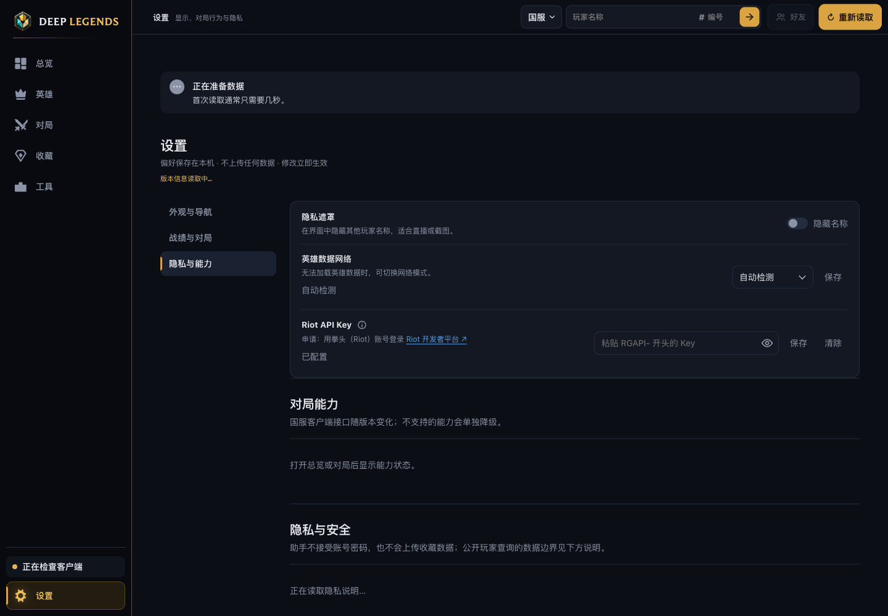
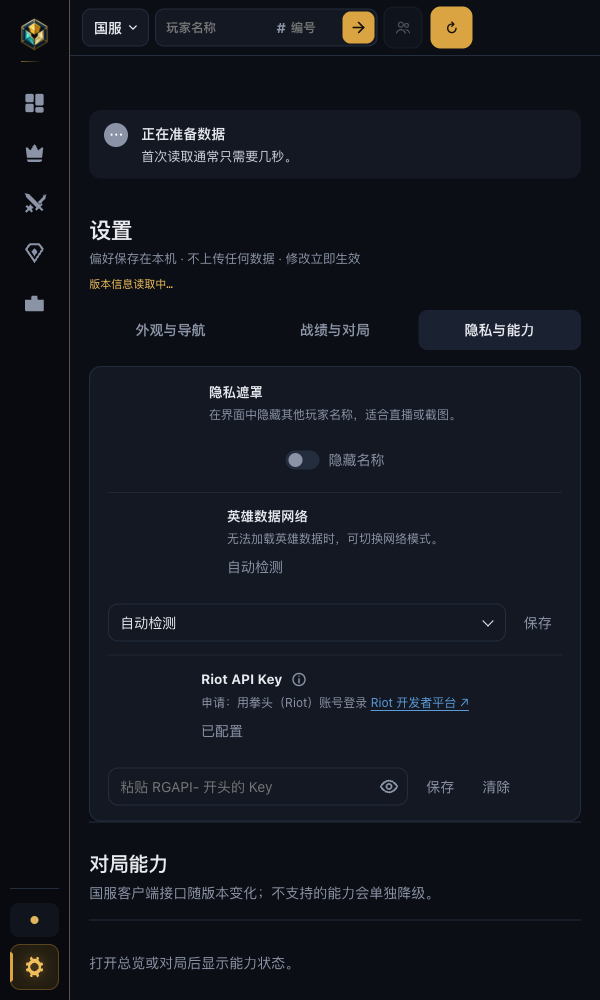

# R210 执行账本

日期：2026-10-04。工单：[R210](WORKLIST-R210-RIOT-KEY-CARD-REDESIGN-AND-HELP-AND-LIVE-PAGE-STUCK-ON-ENDED-GAME.md)。基于 R206～R209 之后的当前工作区，版本沿用 **0.12.71**，不单独递增。按既有用户指示及本工单收尾要求，本轮不构建、不打包、不发布桌面程序。

## P1 Riot API Key 设置卡片

- index.html 中 Key 行移入隐私遮罩/英雄数据网络共用的 settings-grid，紧跟英雄数据网络，使用相同的行分隔线。左列为标题、说明图标、简短申请链接及原状态元素；右列为输入框、内嵌眼睛按钮、保存和清除，沿用 setting-network-controls 与 text-button。
- 输入框固定 300px，控件共享样式和高度/边框/背景变量，实际浏览器核对输入框与增强后的网络下拉控件均为 38px 高、10px 圆角，相同背景、边框、字体、内边距和焦点边框/内侧光环。窄窗沿用现有 620px 响应式规则；600px 回放中控件换到说明下一行，左对齐且无横向溢出。
- 眼睛按钮透明背景、32×32px，位于输入框内部右侧；根据 aria-pressed 显示睁眼/闭眼图标。复用原点击、保存、清除逻辑，成功保存后输入框为空且恢复 password，状态继续表示已配置/未配置/无效/使用内置服务。不回显已保存的 Key。
- 链接使用工单要求的 href、target、rel，强调色和下划线，悬停/键盘焦点可见。按用户随后追加要求，将服务说明移到标题旁的信息图标，复用现有悬停/键盘焦点提示；申请行止于「Riot 开发者平台 ↗」，删除链接后的开发 Key 失效和个人 Key 申请文字。未改变 desktop 外链处理。
- 初次全量 Node 的 R117 圆角预算失败：新增的圆角变量表达式被算为一个新取值。随后复用既有 10px 共享圆角声明及眼睛按钮的 radius-sm，保持预算规则不变；R117 与 R210 定向复测通过，最终全量结果见下。

以下为真实 index.html、app.css、runtime.js、app.js 加演示接口响应的浏览器截图；输入框为空，状态“已配置”由演示数据提供，没有读取真实 Key。演示页仅在本机静态服务器回放，所有 API 被 fixture 拦截。计算样式及眼睛切换元数据见 [browser-styles.json](history/reports/r210/browser-styles.json)，可复现页面见 [settings-preview.html](history/reports/r210/settings-preview.html)。

用户追加调整后，更新以上两张截图及演示页；1440px、600px 浏览器回放均无横向溢出，悬停图标可显示完整说明。提示截图见 [宽窗](history/reports/r210/settings-help-hover.png)、[窄窗](history/reports/r210/settings-help-narrow-hover.png)。R117、R204、R210 定向复测 18/18 通过，包含实际 app.js 悬停显示、移出隐藏及原眼睛/保存/清除事件；见 [node-help-followup.log](history/reports/r210/node-help-followup.log)。追加修改仅涉及设置页 HTML/CSS 与对应断言，`git diff --check` 通过，版本和构建暂停状态保持。

## P2 赛后名单清理

- postGameSnapshot 仅在 WaitingForStats、PreEndOfGame、EndOfGame 返回保留快照；其他阶段返回 false 并清理同一客户端的保留状态。observePostGameReveal 对所有非结算阶段停止并清空。Lobby、None、Matchmaking、ReadyCheck 等记录 left_end_of_game；下一局对局阶段保持既有 stopped 行为。
- 保留快照在补全流程完成后最多存在两分钟，成功、失败和重试耗尽都经同一个 finish 设置期限与自动定时器；读取时也按注入 now 检查期限。到期取消 context/timer、清空快照并记录 expired，无需后续读取才能清理。过期游戏留下同客户端/gameId 的标记，重复 EndOfGame 不会重新从普通 cache 捕获旧名单。
- 取消、过期与快照发布继续由状态锁及 client/generation 隔离；旧定时器不能清理下一代快照，离开阶段后迟到的补全结果不能重新写入。补全重试中的阶段探测也拒绝非结算阶段，在读取战绩前停止。
- 前端 EndOfGame 等结算阶段离开到 Lobby/None 等非对局阶段时立即取消旧 roster 请求、清名单、清等待新局状态并显示既有“等待进入对局”空态。复用 resetLiveGameScopedState，记录 live_scope_reset reason=left_end_of_game，后端 reason 白名单同步放行。R207 的推荐缓存/异步代际规则不改，按原 scoped reset 收尾上一局。
- 完整响应路径过滤闲置阶段里的旧 gameId/players；请求 token 隔离离开结算前的在途响应。已确认离开结算后，迟到的旧结算快照也被拒绝，避免页面回退。下一局 ChampSelect 正常读取新名单；R207 的开局推荐保留回归仍通过。
- 已更新索引中 R197 备注，明确赛后保留快照的清理由 R210 P2 修正；保留 R197 结算内成功补全及原有下一局停止行为。

## 自动验证

- Go：新增五项测试，使用 R197 实际 HTTP RoundTripper 夹具运行补全流程。覆盖所有指定闲置阶段直接读快照和 phase 观察入口清理、普通 live cache 不回填、成功及三次失败后两分钟边界、重复 EndOfGame 不复活、定时器不依赖读取自动清理、旧 generation 不清理新快照、前端清理诊断实际 handler 落盘。连同原 R197 测试通过，见 [go-targeted.log](history/reports/r210/go-targeted.log)。
- Node：R210 四项真实行为测试通过，见 [node-r210.log](history/reports/r210/node-r210.log) 及 [node-style-r210.log](history/reports/r210/node-style-r210.log)。设置页使用实际 app.js 点击事件验证眼睛、保存与清除；live 回放编译真实 loadLive、handleGameplayPhase、reset、renderLive、renderRecommendationArea 与 renderLivePlayer，实际 DOM 断言十人名单和空态，未以清空桩替代生产逻辑。
- 回放顺序 Reconnect → WaitingForStats → EndOfGame → Lobby → None，保留上一局旧 gameId 的闲置响应不会恢复名单；Lobby phase 信号到达即清空，推荐缓存归零且诊断记录 clearedRecommendations=1；下一局 ChampSelect 显示新十人名单。额外覆盖在途旧请求与新请求收到迟到 EndOfGame 的情况。
- R204/R206/R207/R208/R94 定向 Node 36/36 通过，见 [node-targeted.log](history/reports/r210/node-targeted.log)。实际浏览器另行验证两种宽度、控件计算样式、焦点和图标切换。
- 四项源码变异均由行为断言杀死，非编译/语法/引用错误，正式源码保持正确实现：恢复非对局阶段都返回 → Go 闲置阶段测试 FAIL；去掉过期处理 → Go 两分钟测试 FAIL；去掉前端离开结算清空 → Lobby 即时清空断言 FAIL；额外去掉闲置响应过滤 → 旧名单回填断言 FAIL。见 [mutations.json](history/reports/r210/mutations.json) 及同目录原始日志。
- `go test ./backend -count=1`：通过，252.837 秒，见 [go-full.log](history/reports/r210/go-full.log)。
- `go test -race ./backend -run '^TestR210' -count=1`：通过，2.366 秒，见 [go-race.log](history/reports/r210/go-race.log)。
- `go vet ./backend`：通过，见 [go-vet.log](history/reports/r210/go-vet.log)。
- `node --test backend/web/*.test.cjs desktop/*.test.cjs`（tap 报告格式）：1174 项，1173 通过、1 项平台门禁跳过、0 失败，257.682 秒，见 [node-full.log](history/reports/r210/node-full.log)。包含 R206～R209 当前工作区的回归。
- 最终 `git diff --check` 通过；desktop/package.json、lockfile 顶层与根 package 版本均为 0.12.71，见 [checks.json](history/reports/r210/checks.json)。

## 构建、发布与真机边界

实现完成，工单保留进行中。沿用合并版本 0.12.71；桌面构建、打包、发布等待用户恢复后与 R206～R209 合并，届时按 R199 发布证据规则核对。本轮未生成安装包或发布 Release，自动回放与演示截图不替代 Windows 真机验收。

待用户真机验证：隐私与能力设置卡片布局、眼睛与申请链接经系统浏览器打开；有隐藏玩家的对局结束回大厅后显示等待进入对局；日志出现 left_end_of_game 或 expired。其他原有工单的验收边界保持。
