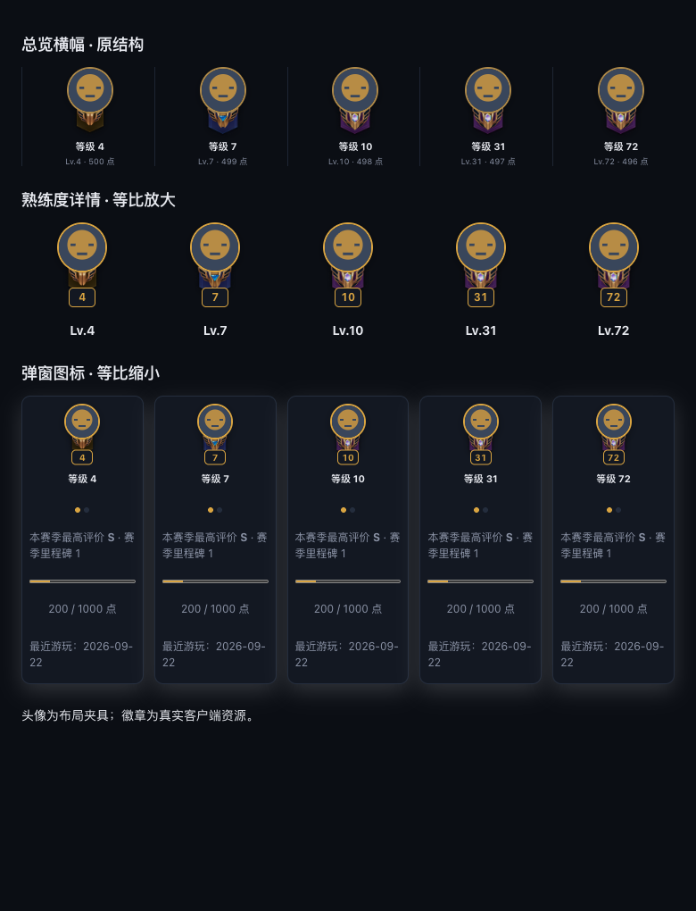

# R214 执行账本

日期：2026-10-04。基线：0.12.71 + R211/R212/R213 未提交工作区。R214 四项实现与自动验证完成，真机验收待用户运行新版。没有构建、打包或发布，版本保持0.12.71。保留其他工单改动；R211 工单、账本和索引状态保持原样，评分v3/P2标签/P6英雄表继续暂停。

## P1 构建页海克斯说明

`renderBuild` 取得 `buildSubject` 最终玩家后，调用真实 `ensureAugmentDescriptions`，覆盖首次展开和切换。沿用按 ID 去重、最多6个和 loading/已有结果不重复请求。额外修正完成回调 `rerenderAugmentDescriptionViews`：它此前只检查本人 ID，现检查当前选中玩家 ID，才能在他人说明返回后重绘这局。只更新受这些 ID 影响的已展开构建卡，不重建整页；已有关联卡共用同一 ID 时仍沿用R191更新对应卡。

测试使用真实 renderBuild/renderBuildAugments/ensureAugmentDescriptions/完成回调/选择按钮绑定，仅说明网络API使用确定响应。本人的1、2首次请求，选择另一人后只请求3、4，返回后DOM出现两项说明且没有skel；加载中重绘不重复请求，切回本人不发新请求，无关局215不重绘。删除新增调用的变异测试失败于缺少3、4请求，成功检出，详见 [p1-mutation.json](history/reports/r214/p1-mutation.json)。

## P2 熟练度徽章叠放

复用横幅同一套结构和客户端资产。头像z=2，徽章z=1，数字z=3。横幅头像52px、徽章42px、顶距36px；详情头像56px，徽章45.2308px、顶距38.7692px；弹窗头像40px，徽章32.3077px、顶距27.6923px。尺寸与位置均用同一比例CSS计算，不另调一套。数字牌中心置于徽章最下沿，一半露在外面，留在容器预留空间内。

Chromium 对等级4、7、10、31、72分别用生产横幅、详情、弹窗结构并排截图，1280和780两档。≥10使用实际crest10但显示原等级。下载保存客户端真实4/7/10徽章，头像是明确标记的布局夹具。测得头像/徽章层级、42/52尺寸比、36/52顶距比、数字牌中心在徽章底沿、图片已完成加载，无页面横向溢出；肉眼复核头像完整、中心宝石可见、数字不遮宝石。

宽图：[mastery-comparison-wide.png](history/reports/r214/mastery-comparison-wide.png)。尺寸原始值：[layout.json](history/reports/r214/layout.json)。拼版只调整卡片横排和弹窗外框的宽度，不改变图标比例；真实客户端完整页面/鼠标交互待真机。

## P3 fresh 后的近期排位与赛季头部

`loadRecentRankedSampleQueue` 在 overviewFreshHistory 为真时跳过近期样本缓存并传SGP NoCache=true；成功后照常写回近期样本缓存，普通打开仍复用缓存。由请求传 fresh 到 startSeasonStatsRefresh，后台扫描用useHistoryCache=!fresh。fresh同时跳过完成快照和10秒查询时间去重，避免新局刚结束就被赛前完整快照拦住；保留同账号在途扫描合并，避免同时写赛季累计。

新增 `season_stats_head_refresh` 诊断，记录fresh/use_history_cache、上游请求/字节/历史调用/缓存命中、实际计入场次和完成状态。普通加载的缓存与去重行为不变。

| 测试 | 上游增量请求 | history calls | cache hits | 结果 |
|---|---:|---:|---:|---|
| fresh近期420样本，两层已暖缓存 | 1 | 1 | 0 | 读取新局215；普通读仍缓存；fresh结果写回后普通读看到215 |
| fresh赛季头部，SGP页/完整快照/时间去重均已暖 | 1 | 1 | 0 | 新局215累加，实际场次1→2；普通加载继续时间去重 |

计数来自实际fixture上游与真实诊断，不是源码断言；日志：[cache-target.log](history/reports/r214/cache-target.log)。真机新排位局进入列表、近期排位与英雄胜率的同步待验收。

## P4 v2 评分悬停

v2评分、权重、名次、徽章与色档保持原算法，只在分项记录中保留计算时已有norm。scoreChip不再发送公式文本；第一行“本局评分 · 全场第 N”，右侧总分，各可用维度显示名称、归一条形、原始值，缺失维度不显示。参团原值用百分比，其余用现有原始量。

浮动tooltip通过经过验证的JSON数据与textContent/createElement构造，条长对应norm，不引入HTML字符串执行。已有通用姓名/海克斯/名单悬停保持原行为。真实DOM测试验证缺视野的5条、持平50%、伤害较低条长<50%、全部条宽与norm一致、不含公式/基准/中位数/非官方/贡献=/v2；恶意字符串仍为文字，越界norm回退普通文本提示。

## 收尾验证

| 检查 | 结果 |
|---|---|
| go test ./backend | 全量通过，252.250秒 |
| go vet ./backend | 通过，无输出；系统Go缓存需要沙箱外访问，已完成 |
| P3相关-race（TestR214/RecentRankedSamples/SeasonQuery/R211SGP） | 通过，2.006秒 |
| backend/web Node全量 | 915/915通过，14.517秒 |
| desktop/overview-render.test.cjs | 完整单文件55/55通过，244.770秒，没有跳过长测试 |
| P1变异 | 删除新增请求调用后失败，caught=true |
| Chromium比对 | 3种图标结构×5种等级×2档窗口，比例/层级/底沿/无溢出均通过 |
| git diff --check | 通过 |

机器可读总表与日志位于 [verification.json](history/reports/r214/verification.json) 及同目录。独立只读复核未发现遗漏或确定bug；探子Go执行受缓存权限阻止，主线程已在允许的权限下跑完Go全量/vet/race，不以探子权限失败冒充代码失败。

修正了旧测试对公式文案和tooltip布局枚举的断言，保留评分贡献总和验证，增加归一条形与安全DOM断言；R211桩仅用于原有装备/技能切换测试，本单新增用真实说明实现覆盖骨架故障。R191测试补入实际buildSubject依赖。R211旧截图脚本同步正确徽章比例与层级断言，未重新改写R211历史报告。

## 用户真机验收

1. 海斗/斗魂构建切到别人，海克斯说明正常显示。
2. 熟练度详情/弹窗与横幅叠放一致，头像在前，中心宝石可见。
3. 打完单双/灵活，列表、近期排位、英雄胜率更新；诊断fresh扫描history hits=0。
4. 评分悬停仅名次/总分/分项条形，没有公式说明。

以上待恢复构建后验收。本轮不构建、不发布；不关闭R211，不恢复其暂停的评分与依赖功能。
